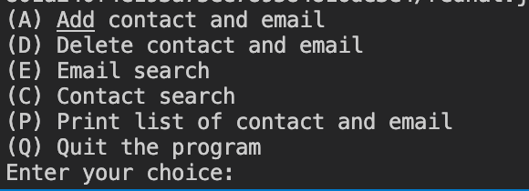

# Data Structure Assignment

## Contact Book Application (contact name, email address)

## Overview

This contact book application with simple responsibilities, to manage users contact book information.

## Features

1. Add contact and email
2. Delete contact and email
3. Search contact and email
4. Print every contact book information

## How to use

1. Run the program, you will get this output

2. You will choose one of letters at the very first step, such as A, D, E, C, P, Q
As they are the provided letters for continue working with contact book information applications.
